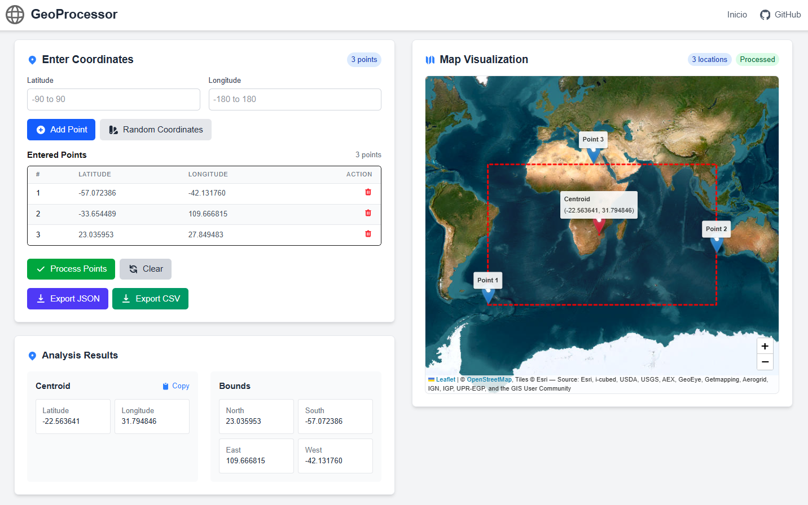
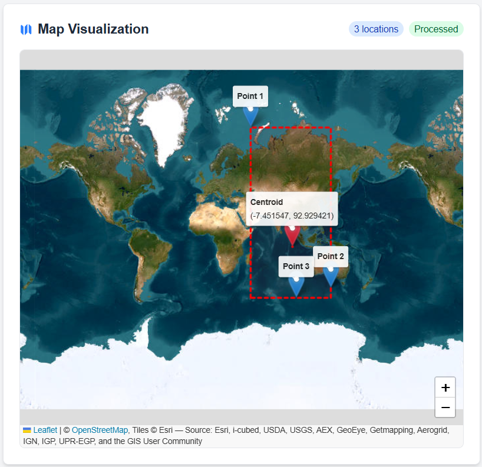
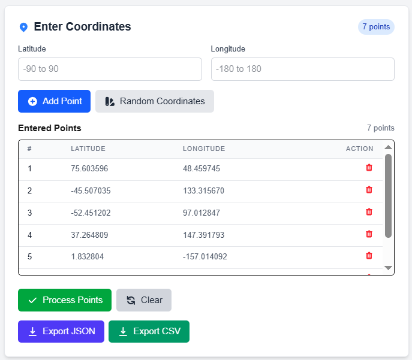
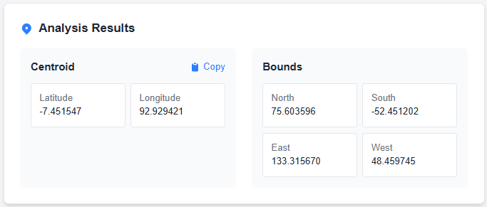

# GeoProcessor - Geospatial Processing Application

A full-stack application for geographic data processing, providing tools for coordinate management, centroid calculation, and boundary determination.

## Table of Contents

- [Overview](#overview)
- [Screenshots](#screenshots)
- [Architecture](#architecture)
  - [Repository Structure - Monorepo Approach](#repository-structure---monorepo-approach)
  - [Network Architecture and Security](#network-architecture-and-security)
  - [Technical Stack](#technical-stack)
- [Features & Implementation Decisions](#features--implementation-decisions)
  - [Architecture Decisions](#architecture-decisions)
  - [Frontend Design Decisions](#frontend-design-decisions)
  - [Backend Design Decisions](#backend-design-decisions)
  - [API Gateway Decisions](#api-gateway-decisions)
- [Running the Application](#running-the-application)
  - [Prerequisites](#prerequisites)
  - [Setup and Installation](#setup-and-installation)
- [API Documentation](#api-documentation)
- [Testing](#testing)
- [Contact](#contact)

## Overview

GeoProcessor is a professional geospatial data processing application built as a technical challenge. The application allows users to:

- Input geographic coordinates (latitude/longitude)
- Visualize points on an interactive map
- Calculate the centroid (geometric center) of points
- Determine the bounding box (north, south, east, west limits)
- Export results in JSON and CSV formats

## Screenshots

### Main Interface


### Map Visualization


### Coordinates Panel


### Results Panel


## Architecture

### Repository Structure - Monorepo Approach

This project uses a monorepo architecture to house all services in a single repository, which offers several advantages:

**Rationale for Monorepo:**
- **Simplified Dependency Management**: Shared dependencies can be managed more efficiently
- **Atomic Changes**: Ability to make cross-service changes in a single commit
- **Improved Collaboration**: Easier for developers to understand the entire system
- **Simplified CI/CD**: Unified pipelines for testing and deployment
- **Version Consistency**: All services are inherently versioned together, ensuring compatibility
- **Containerization Synergy**: Docker and Docker Compose integration is streamlined with a monorepo, allowing for centralized container orchestration and networking
- **Development Consistency**: Developers can run the entire application stack locally with a single command

```
Geo-processor/
├── docker-compose.yml      # Container orchestration with network segmentation
├── README.md               # Project documentation
├── services/               # All application services
│   ├── api-gateway/        # NestJS API Gateway service with Redis caching
│   ├── backend/            # Python FastAPI backend service (isolated network)
│   └── frontend/           # Next.js frontend service
├── redis/                  # Persistent Redis cache container configuration
├── .github/                # CI/CD workflows and GitHub configurations
└── .docker/                # Docker configuration files and environment settings
```

### Network Architecture and Security

The application utilizes Docker network segmentation to enforce a secure communication pattern:

```
                    │                │
                    │                │
 ┌─────────────┐    │    ┌──────┐    │    ┌─────────┐
 │             │    │    │      │    │    │         │
 │   Client    ├────┼───►│  API │    │    │ Backend │
 │             │    │    │ Gate │◄───┼───►│ Service │
 └─────────────┘    │    │ way  │    │    │         │
                    │    │      │    │    └─────────┘
                    │    └──┬───┘    │
                    │       │        │
                    │       ▼        │
                    │    ┌──────┐    │
                    │    │      │    │
                    │    │Redis │    │
                    │    │Cache │    │
                    │    │      │    │
                    │    └──────┘    │
                    │                │
                    │  Public Net    │  Private Net
                    └────────────────┘
```

This architecture ensures that backend services are not directly accessible from the public network, adding a crucial security layer.

### Technical Stack

The application is built on a modern, scalable tech stack:

#### Backend (Python FastAPI)
- **FastAPI**: High-performance Python framework
- **Pydantic**: Data validation and settings management
- **Pytest**: Comprehensive testing framework
- **Docker**: Containerization for consistency and portability

#### API Gateway (NestJS)
- **NestJS**: Progressive Node.js framework for building server-side applications
- **TypeScript**: Type safety and enhanced developer experience
- **Redis**: In-memory data caching for improved performance with persistent storage
- **Jest**: Testing framework for Node.js
- **Swagger**: API documentation

#### Frontend (Next.js)
- **Next.js**: React framework for production
- **React**: Component-based UI library
- **TypeScript**: Type-safe code
- **Tailwind CSS**: Utility-first CSS framework for rapid UI development
- **Leaflet**: Interactive maps
- **React Hook Form**: Form validation and handling

## Features & Implementation Decisions

### Architecture Decisions

1. **Microservices Architecture**:
   - **Rationale**: Each component (frontend, API gateway, backend) runs as a separate service to enable independent scaling and deployment.
   - **Benefit**: Improved maintainability and flexibility for future enhancements.

2. **API Gateway Pattern with Network Segmentation**:
   - **Rationale**: NestJS serves as an API gateway to route requests to the appropriate services, with network segmentation implemented to protect backend services.
   - **Benefit**: Centralized request handling, authentication, and cross-cutting concerns.
   - **Security**: Backend services are isolated in separate Docker networks, preventing direct external access and ensuring all traffic must flow through the API Gateway.

3. **Containerization with Docker and Network Security**:
   - **Rationale**: Each service is containerized for environment consistency and integrates seamlessly within the monorepo structure.
   - **Benefit**: "Works on my machine" problems are eliminated, deployment is simplified, and the entire system can be launched with a single command.
   - **Implementation**: Docker Compose orchestrates all services including a dedicated Redis cache container with data persistence volumes, ensuring cached data survives container restarts. Optimized Dockerfiles for each service minimize image size and startup time.
   - **Network Segmentation**: Implemented distinct Docker networks to isolate services: the backend API is only accessible through the API Gateway, not directly from external clients, enhancing security.

### Frontend Design Decisions

1. **Responsive UI with Tailwind CSS**:
   - **Rationale**: Used utility-first CSS approach for rapid development and consistent styling.
   - **Benefit**: Application works seamlessly across desktop and mobile devices with minimal custom CSS.

2. **Component Architecture**:
   - **Rationale**: The UI is broken down into reusable, focused components.
   - **Benefit**: Improves maintainability and makes the codebase more modular.

3. **Client-side Form Validation**:
   - **Rationale**: Implemented thorough input validation using React Hook Form.
   - **Benefit**: Prevents invalid data submissions and provides immediate user feedback.

4. **Dark Mode Support**:
   - **Rationale**: Implemented system-preference-based theme switching.
   - **Benefit**: Enhances user experience in different lighting conditions and respects user preferences.

5. **Dynamic Map Visualization**:
   - **Rationale**: Leveraged Leaflet for interactive maps with dynamic markers and boundaries.
   - **Benefit**: Users can visually understand the geographic data they're working with.

6. **Progressive Enhancement**:
   - **Rationale**: Core functionality works without JavaScript, with enhanced features when available.
   - **Benefit**: Improved accessibility and performance across devices.

### Backend Design Decisions

1. **FastAPI for Python Backend**:
   - **Rationale**: Selected for its performance, automatic OpenAPI documentation, and native async support.
   - **Benefit**: High throughput with minimal code, built-in validation, and self-documenting APIs.

3. **Data Validation**:
   - **Rationale**: Rigorous input/output validation using Pydantic models.
   - **Benefit**: Type safety, automatic validation, and clear error messages.

4. **Comprehensive Testing**:
   - **Rationale**: Unit and integration tests cover key functionality.
   - **Benefit**: Ensures reliability and makes refactoring safer.

5. **API Design**:
   - **Rationale**: RESTful principles with clear resource naming and appropriate HTTP methods.
   - **Benefit**: Intuitive API that's easy to understand and consume.

### API Gateway Decisions

1. **NestJS for API Gateway**:
   - **Rationale**: Provides a robust framework with built-in support for microservices.
   - **Benefit**: Strong typing with TypeScript and modular architecture for maintainability.

2. **Redis Caching Implementation**:
   - **Rationale**: Added Redis as an optional but performance-enhancing component for caching frequent geospatial calculations.
   - **Benefit**: Significantly reduces processing time for repeated operations, improving API response times and reducing computational load.
   - **Implementation**: Coordinates are hashed to create unique cache keys, with cache invalidation strategies for data freshness.
   - **Persistence**: Redis runs as a dedicated container with volume mapping to ensure cache persistence even when containers are restarted.

3. **Secure Request Proxying**:
   - **Rationale**: API Gateway forwards requests to the appropriate service while enforcing access controls.
   - **Benefit**: Clients need only interact with a single endpoint, simplifying the architecture.
   - **Security Layer**: The Gateway acts as a security boundary, controlling all access to backend services which are otherwise inaccessible from the public network.

## Running the Application

### Prerequisites

- Docker and Docker Compose
- Git

### Setup and Installation

1. Clone the repository:
   ```bash
   git clone https://github.com/glondonot/Geo-processor.git
   cd Geo-processor
   ```

2. Start the application using Docker Compose (includes Redis cache and network segmentation):
   ```bash
   docker-compose up -d
   ```

3. Access the application:
   - Frontend: http://localhost:3000
   - API Gateway: http://localhost:3001

## API Documentation

### Backend API Endpoints

- `POST /api/v1/process`: Process geographic coordinates
  - Request: List of coordinates (latitude, longitude)
  - Response: Centroid and bounding box

### API Gateway Endpoints

- `POST /api/process`: Forwards to backend processing endpoint
  - Same request/response format as the backend endpoint
  - Acts as the only access point to backend services due to network segmentation

## Testing

### Running Tests

1. **Backend Tests**:
   ```bash
   cd services/backend
   pytest
   ```

2. **API Gateway Tests**:
   ```bash
   cd services/api-gateway
   npm run test
   ```

3. **Frontend Tests**:
   ```bash
   cd services/frontend
   npm run test
   ```

## Contact

Gabriel Londoño - [GitHub Profile](https://github.com/glondonot)

Project Link: [https://github.com/glondonot/Geo-processor](https://github.com/glondonot/Geo-processor)
